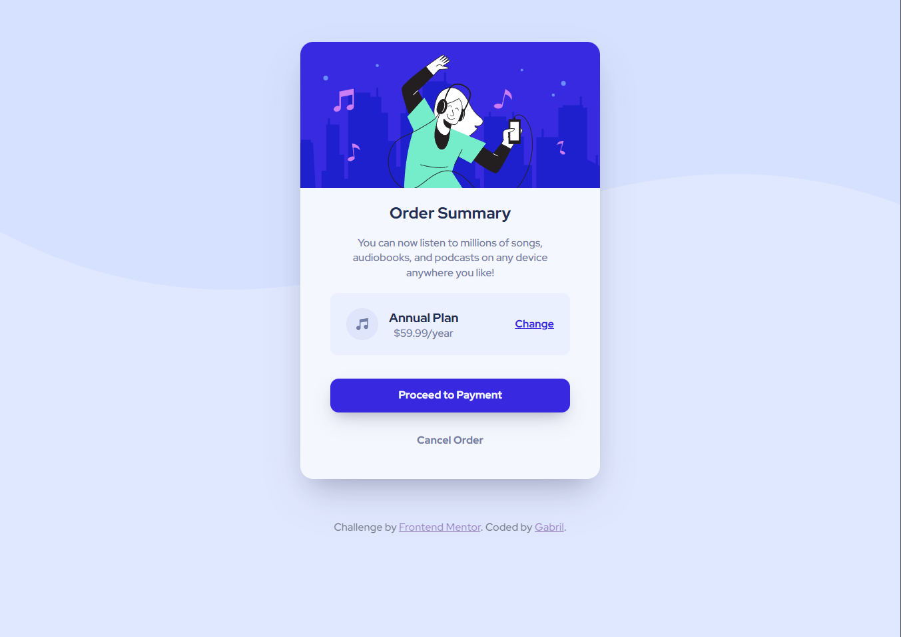

# Frontend Mentor - Order summary card solution

Esse projeto é uma solução do desafio: 

[Order summary card challenge on Frontend Mentor](https://www.frontendmentor.io/challenges/order-summary-component-QlPmajDUj) - 
*Frontend Mentor challenges help you improve your coding skills by building realistic projects.*

## Índice

- [Frontend Mentor - Order summary card solution](#frontend-mentor---order-summary-card-solution)
  - [Índice](#índice)
  - [Sobre](#sobre)
    - [O desafio](#o-desafio)
    - [Screenshot](#screenshot)
    - [Links](#links)
  - [O processo de desenvolvimento](#o-processo-de-desenvolvimento)
    - [Feito com](#feito-com)
    - [O que aprendi](#o-que-aprendi)
    - [Desenvolvimento futuro](#desenvolvimento-futuro)
    - [Recursos úteis](#recursos-úteis)
  - [Autor](#autor)


## Sobre

### O desafio

Os usuários precisam:

- Ver o estado dos elementos mudando durante o *hover*

### Screenshot




### Links

- URL Solução: [GitHub](https://github.com/gjperes/frontend-projects/tree/master/order-summary-component-main)
- URL Live Site: [GitHub Pages](https://gjperes.github.io/frontend-projects/order-summary-component-main/)

## O processo de desenvolvimento

### Feito com

- HTML5
- CSS
- Flexbox
- Mobile-first
- [SASS](https://sass-lang.com/) - Extensão CSS
- [VS Code](https://code.visualstudio.com/) - Editor de Texto
- [Apache2](https://httpd.apache.org/) - Servidor local

### O que aprendi

Melhor entendimento de como utilizar o SASS, como, por exemplo, incluir seletores *childs* dentro dos *parentes*

```scss
.pricing-left-col {
  display: inline-flex;
  align-items: center;
  padding: 0.5rem 1.5rem;

  & > #plan-icon {
    width: 48px;
    height: 48px;
  }
}
```

Como adaptar alguns elementos para a exibição correta em dispositivos móveis, usando o seletor ```@media```

```scss
// Mobile
@media only screen and (max-width: 375px) {
  .card {
    width: 343px; /*375px - 2*16px*/
    margin: 2rem 1rem;

    img {
      width: 343px; /*375px - 2*16px*/
    }

    .pricing {
      font-size: 80%;

      & > #change-btn {
        margin-left: auto;
        margin-right: 1rem;
      }
    }
  }
}
```

Manter um "eventListener" do SASS, para que as mudanças feitas no código .scss fosse automaticamente salva no arquivo .css - através de um CLI no terminal ```bash``` , no diretório local

```bash
sass -watch style.scss style.css
```

Além de alguns outros detalhes, como tentar agrupar de maneira otimizada os marcadores HTML, criando classes e IDs para guiar a estilização CSS.

### Desenvolvimento futuro

Algumas cores, tamanhos de fonte ou espaçamentos não refletem de maneira idêntica ao conceito original, pois desenvolvi o projeto sem planejamento prévio (criei com foco em gravar conceitos de estilização e sintaxe dos marcadores) - e sem o uso de ferramentas de UX/UI que poderiam auxiliar nisso.

### Recursos úteis

- [MDN Web Docs](https://developer.mozilla.org/en-US/docs/Web/CSS) - Durante vários momentos tive que pesquisar a documentação de síntaxe CSS e, raramente, de HTML.
- [CSS Scan](https://getcssscan.com/css-box-shadow-examples) - Site com alguns estilos de ```box-shadow```, que utilizei como base nas sombras do projeto.
- [SASS](https://sass-lang.com/) - Documentação do SASS.

## Autor

- Perfil GitHub - [Gabril](https://github.com/gjperes)
- Perfil Frontend Mentor - [@gjperes](https://www.frontendmentor.io/profile/gjperes)
