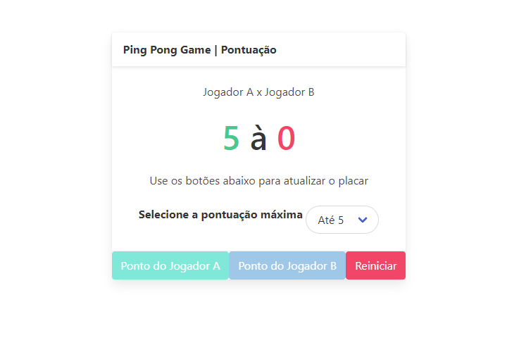

# Score Keeper

O objetivo inicial foi de aplicar conceitos recentes de manipulação DOM com o JavaScript, alguns exemplos são
os seletores:

- ```document.querySelector```
- ```"elemento".classList```
- ```"elemento".addEventListener```

Também foi possível ter contato com um diferente framework CSS, além do Bootstrap: [Bulma CSS](https://bulma.io/)

## Screenshot



## Segunda versão do projeto

O segundo objetivo foi praticar o uso do *npm* (node package manager), e manter uma versão local do webapp, utilizando o *ExpressJS*.

## Melhorias futuras

- Correção/melhoria visual
- Permitir mais jogadores
- Implementar mais regras do jogo e de pontuação, deixando-o mais completo
- Implementar o contador "melhor de X" (um requisito seria: armazenar dados das partidas anteriores)
- Refazer o projeto utilizando o *React*